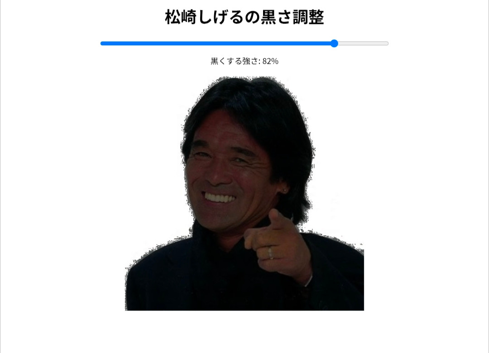

## 初めに
今日から一息で日記を書く習慣をつけていきたいと思ったので始めることにした。というか、少し前からObsidianでやってたんだけど、その時のノートパソコンが壊れて中断していたので、また再開することにした。

日記をかくというのはこれまで何度か挑戦しよとしたものの、途中でやめてしまっていた。その理由を考えるに、クォリティを求めてしまい、それに伴って時間がかかってしまい、それゆえだるくなってしまうという感じ。だから、時間をかけずに行うということをルールにした。Obsidianでやっていた時には10分日記という名前でやっていたけど、毎回10分は過ぎるので一息日記という名前に変更してこれからこっちのブログにアップしていくことにした。せっかく作ったブログサイトがサビていくのはもったいないし、GitHubのサーバーを使ってるから無料。試してみるのは無料。

## 松崎しげるの黒さを調節するアプリを作成
なんとなく思いついたので作ってみた（[■](https://nhennoejo.github.io/ms/)）。

canvasで画像を編集。jpg画像は背景の白いところまで黒くなってしますというところが難しかったけど、白は白を保ってそれ以外を黒くするというアルゴリズムで解決した。

作ってる途中で思い出したけどshu3のこの動画([■](https://www.nicovideo.jp/watch/sm21639894))がそっくり。
多分この動画を脳の片隅で覚えていたんだと思う。だからこのアプリはほとんどパクリみたいなもんです。

久しぶりにウェブ開発して楽しかった。後期からは大学の授業でWeb開発をとったから、リハビリを少しづつしていきたい。

## 反省
最近ジュースを飲む頻度が増えてきた。無理に我慢するものではないと思ってるけど、飲まない方がいいに決まってるので少しづず減らしていきたい。バイト帰りに自販機でコーラの缶を買うことが多い。これが最高に気持ちいい。疲れてて脳がマヒしてるから我慢という選択肢が出てこない。脳は弱い。このジュースは週一回に減らせそう。他の平日に買ってしまうことは少ないのでまだ対処するほどでもないと思う。

## バイトをやめたい
現状やめたい理由として大きな困っていることがあるというわけではない。仕事の内容はだるいししたくないけど、できないことではないし、他のバイトでも似たようのものだと思う。人間関係も悪くない。月1くらいで飲み会があってそれがとても楽しい。だけど、深夜の人手が少なくて、正規の人数よりも少ない人数でさせられることが多い。これがやめたい理由の一つだ。端的に表現するなら搾取っぽさがある。店長はシフト作るの頑張ってくれてるから悪くない。ただ、人手が少ない。だからあんまりしたくない。

それで最近考えていたのがバグバウンティ（[■](https://ja.wikipedia.org/wiki/%E8%84%86%E5%BC%B1%E6%80%A7%E5%A0%B1%E5%A5%A8%E9%87%91%E5%88%B6%E5%BA%A6)）で稼ぐというもの。これで稼ぎたい。これで稼いでバイトの日数を減らしていって、最終的にはバイトをやめたい。そのためにバグバウンティの勉強をしようと持ってる。

この記事（[バグバウンティ入門（始め方）](https://scgajge12.hatenablog.com/entry/bugbounty_beginner)）が出た頃に読んでHacker101を少しだけ解いたっきりになってたから、再開しようと思う。絶対にする。
Hacker101のCTFやHack The Boxも少しだけ解いて楽しかったので、これを解きつつ、記事を読んで稼げるようになりたい。

## おやすみ
おやすみ。